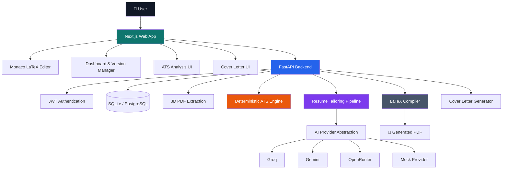

<div align="center">

# ⚡ ResumeForge AI

### The AI-Powered LaTeX Resume Engineering Platform

**Write. Tailor. Analyze. Compile. Compare. Apply.**

[](https://nextjs.org/)
[](https://fastapi.tiangolo.com/)
[](https://www.typescriptlang.org/)
[](https://www.python.org/)
[](https://groq.com/)
[](LICENSE)

<br/>

> **ResumeForge AI turns a real LaTeX resume into a controlled, ATS-aware, job-specific application workflow — without silently overwriting the original.**

<br/>

<a href="https://github.com/udayrastogi0531/ResumeForge-AI">
  
</a>
<a href="https://github.com/udayrastogi0531/ResumeForge-AI/commits/main">
  
</a>
<a href="https://github.com/udayrastogi0531/ResumeForge-AI">
  
</a>

</div>

---

## ✨ What is ResumeForge AI?

ResumeForge AI is an **Overleaf-style AI resume workspace** built around one idea:

> **AI should help tailor your resume — not invent your career.**

Instead of replacing your resume with a black-box AI rewrite, ResumeForge keeps the workflow transparent:

- 📝 Edit the actual **LaTeX source**
- 📄 Upload a **Job Description PDF**
- 🔍 Extract and structure JD requirements
- 🎯 Calculate a **deterministic ATS compatibility score**
- 🤖 Tailor the resume with an AI provider such as **Groq**
- 🛡️ Prevent unsupported claims through validation rules
- 🔀 Review a **source-level diff**
- 💾 Save tailoring as a **new resume version**
- 📦 Compile the final LaTeX into **PDF**
- ✉️ Generate a **job-specific cover letter**

---

## 🎬 Product Flow

<div align="center">

```text
             ┌───────────────────────┐
             │       👤 USER         │
             └───────────┬───────────┘
                         │
                         ▼
             ┌───────────────────────┐
             │  📝 LaTeX Resume      │
             │       Editor          │
             └───────────┬───────────┘
                         │
                Upload JD PDF
                         │
                         ▼
             ┌───────────────────────┐
             │  📄 JD Extraction     │
             │  Skills • Keywords    │
             │  Requirements         │
             └───────────┬───────────┘
                         │
                         ▼
             ┌───────────────────────┐
             │  🎯 Deterministic     │
             │    ATS Analysis       │
             └───────────┬───────────┘
                         │
                         ▼
             ┌───────────────────────┐
             │  🤖 AI Tailoring      │
             │  Groq / Gemini /      │
             │  OpenRouter / Mock    │
             └───────────┬───────────┘
                         │
                         ▼
             ┌───────────────────────┐
             │  🛡️ Validation        │
             │  Truth + JSON + PDF   │
             └───────────┬───────────┘
                         │
                         ▼
             ┌───────────────────────┐
             │  🔀 Review Diff       │
             │  Keep / Apply New     │
             │  Version / Cancel     │
             └───────────┬───────────┘
                         │
                         ▼
             ┌───────────────────────┐
             │  📦 Compile to PDF    │
             │  + ✉️ Cover Letter    │
             └───────────────────────┘
```

</div>

---

## 🧠 Architecture



---

## 🏗️ System Layers

| Layer | Technology | Responsibility |
|---|---|---|
| **Frontend** | Next.js 16 + TypeScript | Product UI, routing, editor, dashboards |
| **Editor** | Monaco | Real-time LaTeX source editing |
| **API** | FastAPI | Application and workflow APIs |
| **Persistence** | SQLAlchemy + SQLite/PostgreSQL | Users, projects, versions and workflow data |
| **Authentication** | JWT + bcrypt | Secure local authentication |
| **JD Parser** | PDF extraction | Convert uploaded JD PDFs into usable text |
| **ATS Engine** | Deterministic Python logic | Transparent compatibility analysis |
| **AI Layer** | Provider abstraction | Groq, Gemini, OpenRouter and Mock |
| **Compiler** | pdflatex | LaTeX → PDF compilation |
| **Testing** | pytest + Playwright flow | Backend and browser validation |

---

## 🚀 Core Features

### 📝 1. Overleaf-Style LaTeX Editor
Edit the **actual resume source code** rather than a simplified form builder.

- Monaco editor
- Syntax-friendly LaTeX workflow
- Live application workflow
- Compile source into PDF
- Preserve the original source

### 📄 2. Job Description Intelligence

Upload a job-description PDF and extract relevant information:

- Required skills
- Keywords
- Responsibilities
- Requirements
- Relevant role terminology

The extracted requirements become the input for ATS analysis and tailoring.

### 🎯 3. Deterministic ATS Engine

The ATS score is **computed by application logic — not by the LLM**.

It analyzes relevant resume/JD signals and can identify areas such as:

- Keyword alignment
- Skill coverage
- Requirement gaps
- Resume terminology

> The score is a heuristic compatibility signal, not a guarantee of recruiter or ATS behavior.

### 🤖 4. AI Resume Tailoring

ResumeForge can tailor the existing LaTeX resume against a JD through the provider abstraction.

Supported architecture:

```
                AI Provider
                    │
        ┌───────────┼───────────┐
        ▼           ▼           ▼
      Groq       Gemini     OpenRouter
        │
        └──────────┬──────────┘
                   ▼
              Mock Provider
              (offline tests)
```

### 🛡️ 5. Truthfulness-First Workflow

The system is designed to avoid fabricating:

- ❌ Skills
- ❌ Employers
- ❌ Education
- ❌ Certifications
- ❌ Achievements
- ❌ Dates
- ❌ Performance metrics

If a JD requirement is not supported by the source resume, the tailoring pipeline can report it as a missing requirement instead of inventing it.

### 🔀 6. Review Before Applying

Every tailoring operation is reviewable.

```text
Original Resume
      │
      ▼
   AI Draft
      │
      ▼
  Source Diff
   ┌──┼──────┐
   ▼  ▼      ▼
 Apply  Keep  Cancel
 New    Original
Version
```

**The original is never silently overwritten.**

### 📚 7. Resume Versioning

Create independent resume versions for different jobs.

Example:

```text
Resume
├── Original
├── Software Engineer — Company A
├── Frontend Developer — Company B
└── AI Engineer — Company C
```

### 📦 8. LaTeX → PDF Compilation

The backend compiles the actual LaTeX source using:

- `pdflatex`
- `-no-shell-escape`
- Temporary compilation directories
- Configurable timeout

Compilation failures return diagnostics rather than silently replacing the source.

### ✉️ 9. AI Cover Letters

Generate a cover letter using the relationship between:

**Resume + Job Description + Target Role**

The cover-letter workflow is kept separate from resume versioning.

---

## 🔐 Safety & Engineering Principles

ResumeForge is intentionally designed around **user control**.

| Principle | Implementation |
|---|---|
| **No silent overwrite** | Tailoring creates a separate version |
| **Source visibility** | User can inspect generated LaTeX |
| **Deterministic ATS** | Score is calculated outside the LLM |
| **Structured AI output** | Fixed JSON contract + repair retry |
| **Compile validation** | Invalid generated LaTeX is rejected |
| **Secret protection** | API keys remain server-side |
| **Production hardening** | LaTeX isolation is explicitly documented |
| **Human review** | User decides whether generated changes are applied |

> **Important:** the model's truthfulness field is not an independent fact checker. Always review the generated diff before using a resume.

---

## 🗂️ Project Structure

```text
ResumeForge-AI/
│
├── apps/
│   ├── api/                         # FastAPI backend
│   │   ├── app/
│   │   │   ├── api/routes/          # API endpoints
│   │   │   ├── ats/                 # ATS engine
│   │   │   ├── compiler/            # LaTeX compiler
│   │   │   ├── core/                # Config, DB, security
│   │   │   ├── models/              # SQLAlchemy models
│   │   │   ├── parsers/             # PDF/JD extraction
│   │   │   ├── prompts/             # AI prompts
│   │   │   ├── providers/            # AI provider abstraction
│   │   │   ├── schemas/             # API schemas
│   │   │   └── services/            # AI JSON utilities
│   │   └── tests/
│   │
│   └── web/                         # Next.js frontend
│       ├── app/                     # App Router pages
│       ├── components/              # Reusable UI
│       ├── lib/                    # API/auth/state utilities
│       └── e2e/                    # Browser acceptance flow
│
├── docs/                            # Architecture & engineering docs
├── docker-compose.yml
├── package.json
├── SECURITY.md
├── CHANGELOG.md
└── README.md
```

---

## ⚡ Quick Start

### Requirements

- Python **3.12**
- Node.js **20+**
- A TeX distribution providing `pdflatex`

For Debian/Ubuntu:

```bash
sudo apt install texlive-latex-base texlive-latex-recommended texlive-latex-extra
```

### 1. Start the API

```bash
cd apps/api

python3 -m venv .venv
source .venv/bin/activate

pip install -r requirements.txt
pip install email-validator

cp .env.example .env

# Mock provider works without an external AI key
python3 -m uvicorn app.main:app --port 8000
```

### 2. Start the Web App

```bash
cd apps/web

npm install
cp .env.example .env.local

npm run dev
```

Open:

```text
http://localhost:3000
```

API:

```text
http://localhost:8000
```

---

## 🧠 Using Groq

Set the backend environment:

```env
AI_PROVIDER=groq
GROQ_API_KEY=your_key_here
GROQ_MODEL=<a current Groq model id>
```

The API key stays **server-side** and is never exposed to the browser.

For local development without external AI access:

```env
AI_PROVIDER=mock
```

---

## 🧪 Testing

### Backend

```bash
cd apps/api

python3 -m pytest tests/test_api.py -v
python3 tests/acceptance_test.py
```

### Frontend

```bash
cd apps/web

npm run lint
npm run build
```

### Browser acceptance flow

```bash
cd apps/web

NEXT_PUBLIC_E2E=1 npm run build
npm start
```

Then:

```bash
python3 apps/web/e2e/full_flow.py
```

The existing MVP validation includes **16 backend tests** and a **28-check browser flow**.

---

## 🌳 Development Roadmap

### ✅ MVP

- [x] LaTeX resume editor
- [x] JD PDF extraction
- [x] Deterministic ATS analysis
- [x] AI resume tailoring
- [x] Resume versioning
- [x] Cover-letter generation
- [x] PDF compilation
- [x] Local authentication
- [x] SQLite persistence
- [x] AI provider abstraction

### 🔭 Next Hardening

- [ ] Database migrations with Alembic
- [ ] Rate limiting
- [ ] Stronger LaTeX sandbox/container isolation
- [ ] Persisted ATS snapshots
- [ ] Expanded version-to-version comparison
- [ ] More frontend automated tests
- [ ] Additional resume import formats
- [ ] Production deployment automation

---

## 📚 Documentation

| Document | Purpose |
|---|---|
| [Architecture](docs/ARCHITECTURE.md) | System architecture |
| [AI Pipeline](docs/AI_PIPELINE.md) | Tailoring and AI flow |
| [ATS Engine](docs/ATS_ENGINE.md) | ATS scoring logic |
| [LaTeX Security](docs/LATEX_SECURITY.md) | Compiler security considerations |
| [Development](docs/DEVELOPMENT.md) | Local development |
| [Deployment](docs/DEPLOYMENT.md) | Deployment guidance |
| [Testing](docs/TESTING.md) | Test strategy |
| [Security](SECURITY.md) | Security policy |
| [Roadmap](docs/ROADMAP.md) | Planned improvements |

---

## ⚠️ Known Limitations

The current MVP intentionally has some limitations:

- Live Groq/Gemini/OpenRouter calls were not tested in the original sandbox validation.
- Docker files were not validated in the original sandbox.
- Alembic migrations are not included yet.
- Rate limiting is not included yet.
- Supabase/OAuth is not included yet.
- LaTeX isolation is process-level rather than container-level.
- ATS scores are not currently persisted on version records.
- Light theme is not currently implemented.

See the engineering documentation for the detailed limitations and hardening plan.

---

## 💡 Design Philosophy

<div align="center">

### **AI-assisted ≠ AI-controlled**

**Your resume.**  
**Your facts.**  
**Your source code.**  
**Your final decision.**

</div>

---

## ⭐ Support the Project

If ResumeForge AI is useful to you:

1. ⭐ Star the repository
2. 🐛 Open an issue for reproducible bugs
3. 💡 Suggest improvements
4. 🔧 Submit a pull request
5. 📣 Share the project

<div align="center">

### Built with ⚡ for developers who want control over their resumes.

**ResumeForge AI — engineer your resume, don't let AI invent it.**

</div>
